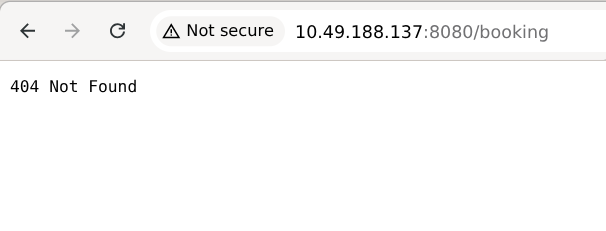
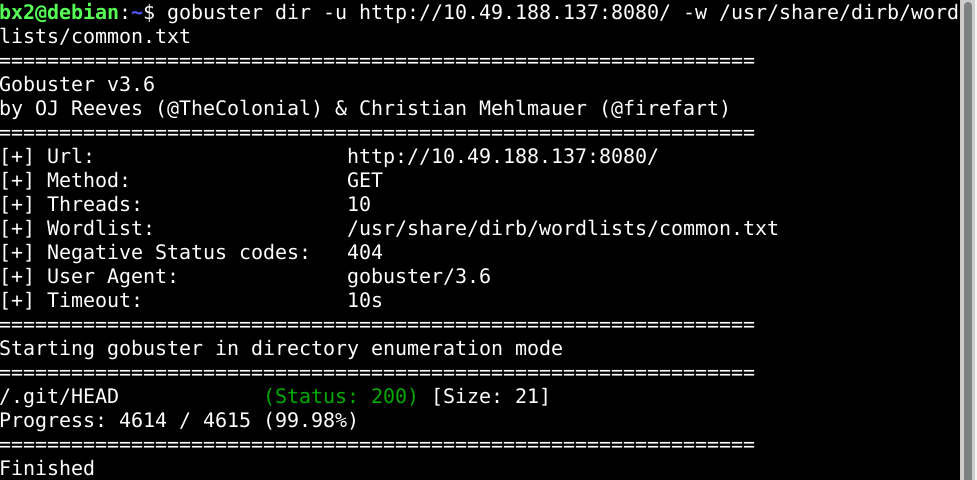
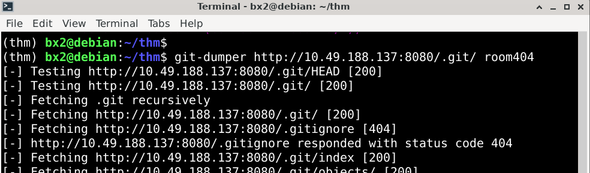
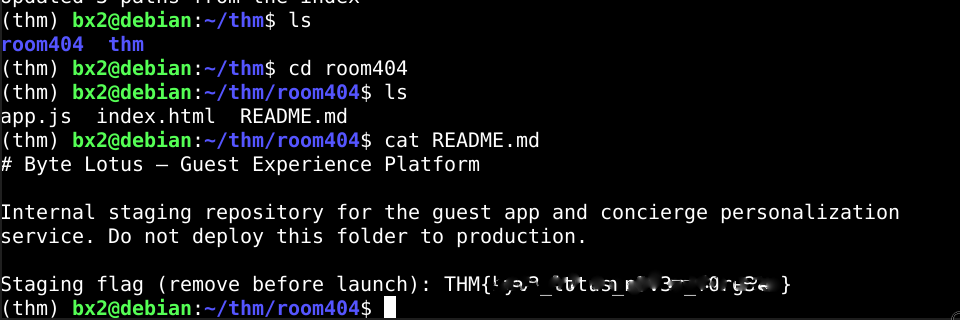

...

# Hacker Holidays 2026 — Day 2
   

**Room:** [Room 404](https://tryhackme.com/room/hh-room404-804573bf)      
**Platform:** TryHackMe  
**Difficulty:** Easy  
**Category:** Source Code Exposure / Web Enumeration   
**Written:** 29 July 2026  

  

  

 

## Description

This writeup documents my methodology for discovering an exposed Git repository through web enumeration and recovering the application's source code to obtain the staging flag.

 

## Initial Recon

- Opened the application on port **8080**.
- Manually explored the website looking for exposed endpoints.
- Discovered a **/booking** endpoint, but it returned a **404** response.

  

  

## Directory Enumeration

Since manual browsing revealed little information and the challenge description mentioned recovering the source code, I shifted to directory enumeration.

I performed directory brute-forcing using Gobuster to identify hidden resources exposed by the web server.

> **CMD:** gobuster dir -u http://10.49.188.137:8080/ -w /usr/share/dirb/wordlists/common.txt  

  

  

**Analysis:** The discovery of `/.git/HEAD` indicated that the server was exposing its Git repository over HTTP.

Although the repository could be browsed through the browser, retrieving the project manually would have been inefficient because Git stores its data across multiple internal objects.

 

## Source Code Recovery

Instead of downloading individual files, I used `git-dumper` to reconstruct the repository from the exposed `.git` directory.

> **CMD:** git-dumper http://10.49.188.137:8080/.git/ room404 

  

  

 

## Source Code Analysis

Once the repository had been reconstructed locally, I reviewed the recovered project files.

A `README.md` file intended only for the staging environment contained the challenge flag.

  

  

 

## Lessons Learned

 - Manual browsing should always precede automated enumeration.
 - Directory enumeration can reveal unintentionally exposed developer resources.
 - An exposed `.git` directory can leak an application's complete source code.
 - Specialized tools such as `git-dumper` greatly simplify repository recovery.

**Final Thoughts:** This challenge highlights how a simple Git repository exposure can lead to full source code disclosure, emphasizing the value of systematic enumeration during web assessments.

   

---

All Hail....

— **Nanashi Bx2** -- Security Researcher 