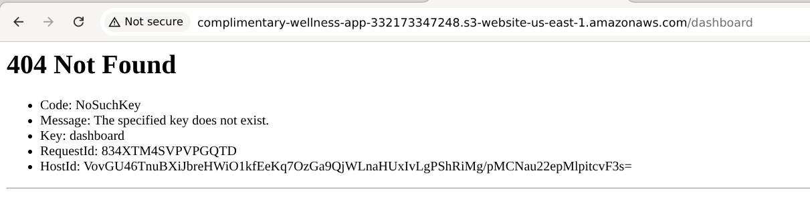
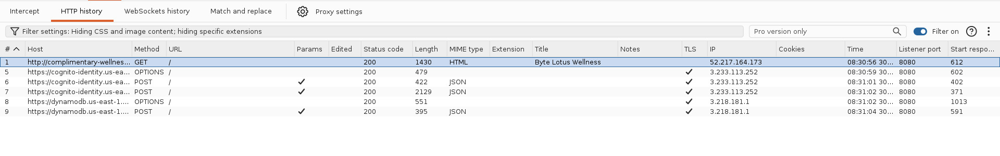
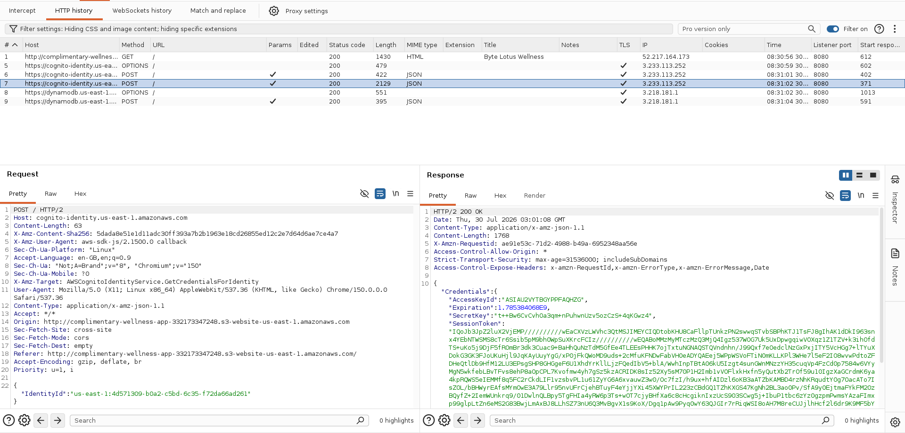
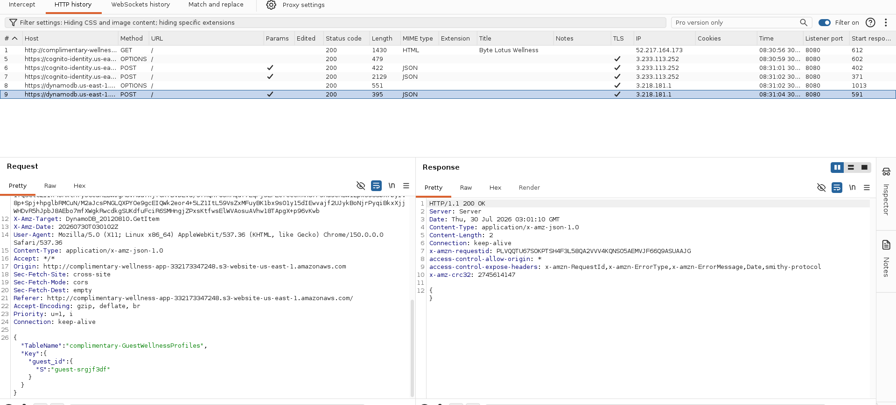
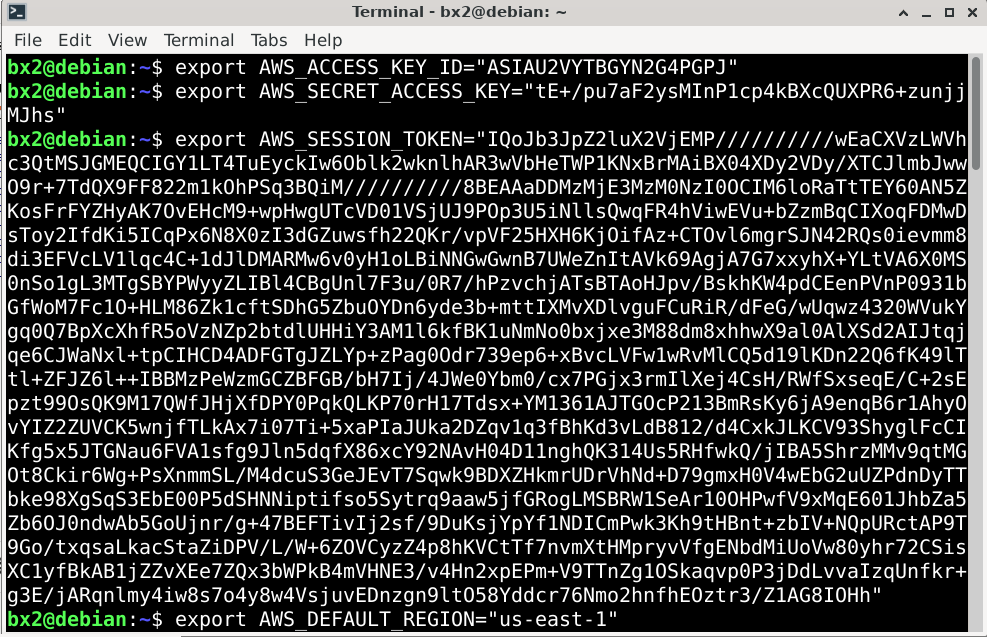
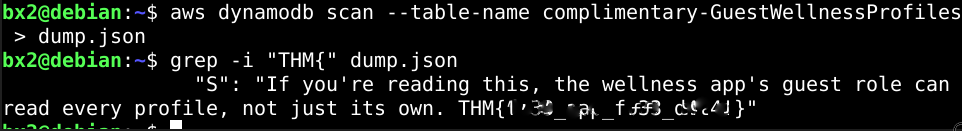

...

# Hacker Holidays 2026 — Day 3
   

**Room:** [Complimentary](https://tryhackme.com/room/hh-complimentary-05e0b604)      
**Platform:** TryHackMe  
**Difficulty:** Easy  
**Category:** Cloud / AWS Credential Exposure   
**Written:** 30 July 2026  

  

  

 

## Description

This writeup documents my methodology for analyzing client-side network traffic, identifying exposed AWS credentials, and using the recovered cloud configuration to enumerate a DynamoDB table containing the challenge flag.

 

## Initial Recon

I began by exploring the application manually.

While browsing the site, I noticed a reference to a dashboard and attempted to access the `/dashboard` endpoint directly. Instead of loading the application, the server returned an error page.

  

  

## Behavioral Observation

While inspecting the `/dashboard` endpoint, the server returned an AWS S3 error page instead of a standard application response.

The presence of values such as `RequestId`, `HostId`, and `Key` suggested that the application was interacting with AWS services behind the scenes. Rather than continuing to guess additional endpoints, I decided to inspect the application's HTTP traffic using Burp Suite.

 

## Traffic Analysis

After opening the application in Burp Suite, I noticed that simply visiting the website generated several additional HTTP requests.

Instead of focusing only on the main page, I began inspecting each of these requests individually to understand what information the application was exchanging in the background.

  

  

 

## Service Enumeration

The captured requests revealed communication with multiple AWS services, including:

- Amazon Cognito
- Amazon DynamoDB

Inspecting these requests exposed temporary AWS credentials together with information identifying the backend database.

  

  

  

  

 

## Cloud Enumeration

After exporting the recovered AWS credentials as environment variables, I configured the AWS CLI session for subsequent requests.

  

  

 

## Flag Retrieval

Using the disclosed table name, I queried DynamoDB and stored the response locally for analysis.

> **CMD:** aws dynamodb scan --table-name complimentary-GuestWellnessProfiles > dump.json  

Once the table had been dumped locally, I searched the exported data for the flag format.

> **CMD:** grep -i "THM{" dump.json

  

  

## Lessons Learned

- Manual browsing helps establish an application's behavior before deeper analysis.
- Background HTTP requests often reveal significantly more information than the visible web interface.
- Temporary cloud credentials exposed to the client can provide unintended access to backend services.
- Understanding how cloud services interact can greatly simplify security assessments.
 

**Final Thoughts:**  This challenge demonstrates how analyzing application traffic can expose sensitive cloud resources. Rather than relying on hidden endpoints alone, inspecting client-side communication revealed temporary AWS credentials that ultimately allowed access to the backend data store.  

   

---

All Hail....

— **Nanashi Bx2** -- Security Researcher 