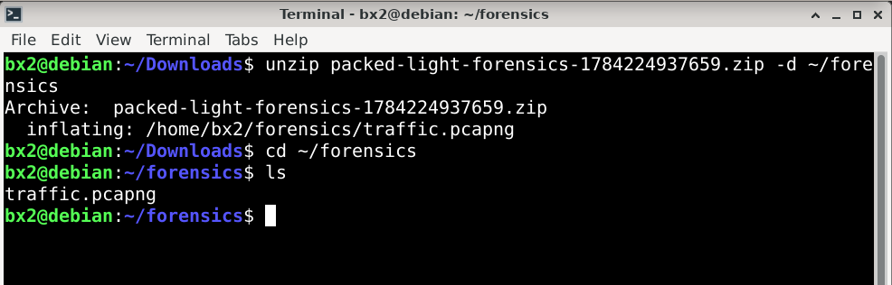
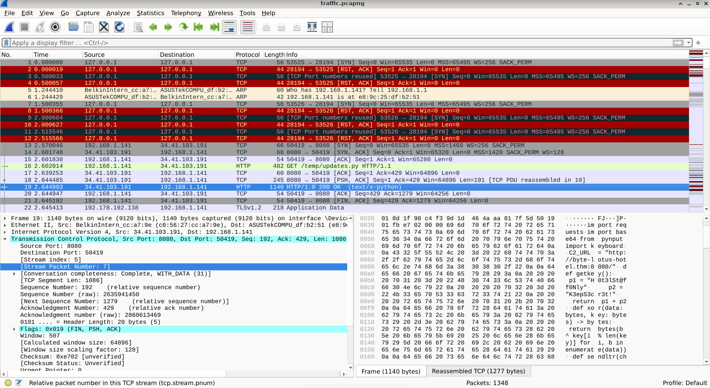
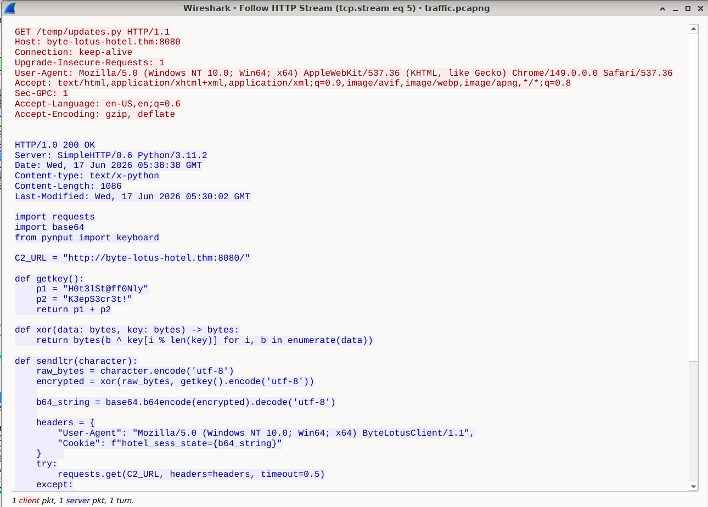
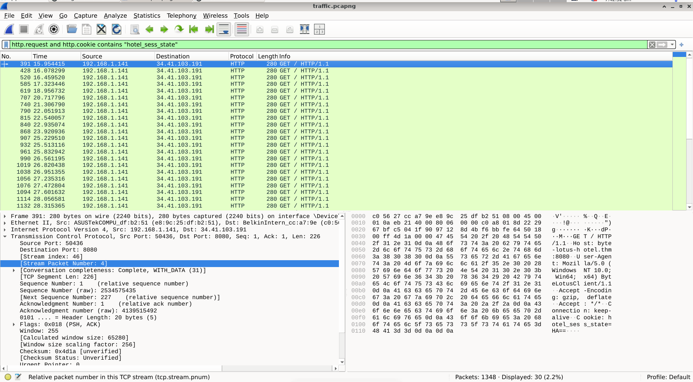
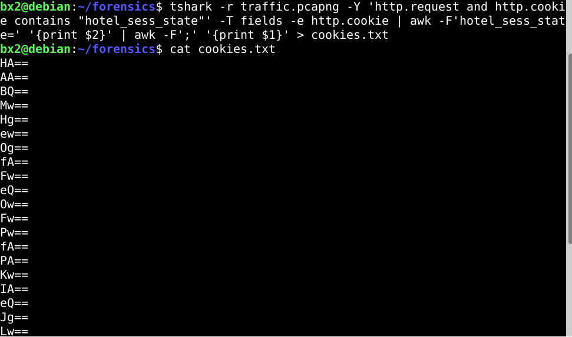
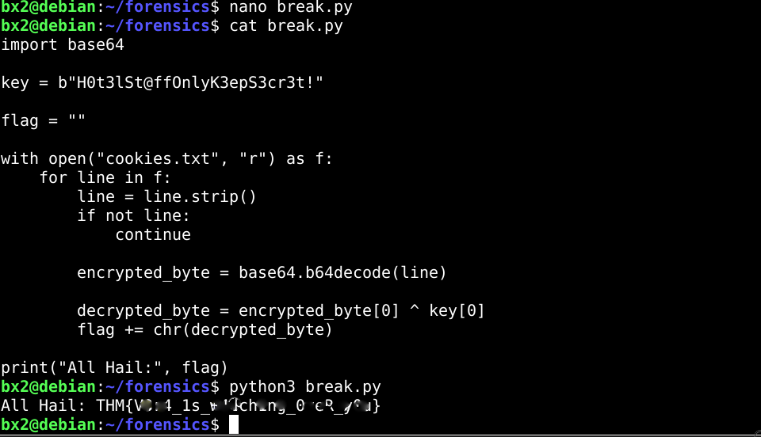

...

# Hacker Holidays 2026 — Day 4  
<br><br><br>

**Room:** [Room Name](https://tryhackme.com/room/hh-packedlight-02e5330c)  
**Platform:** TryHackMe  
**Difficulty:** Easy  
**Category:** Network Forensics / PCAP Analysis / Cryptography  
**Written:** 31 July 2026  

<br><br>

<br><br>

<br>

## Description

This writeup documents my methodology for analyzing a packet capture, identifying a covert communication channel, extracting the transmitted data, and decoding the recovered payload to obtain the challenge flag.


<br>

## Initial Analysis

The challenge provided a ZIP archive containing a single packet capture file.

After extracting the archive, I found a `traffic.pcapng` file and opened it in Wireshark for analysis.

<br><br>

<br><br>


<br>

## Traffic Inspection

I began by inspecting the captured network traffic.

While reviewing the packets, I noticed two HTTP requests that immediately stood out. Rather than continuing through the remaining traffic, I decided to inspect packet **19** in greater detail.

<br><br>

<br><br>


<br>

## Behavioral Observation

Following the selected HTTP stream revealed that the server was serving a Python script instead of a typical web response.

Reviewing the script revealed several important observations:

- A hardcoded XOR key used to encrypt the transmitted data.
- Keyboard input was captured one character at a time.
- Each character was XOR-encrypted.
- The encrypted byte was Base64-encoded.
- The encoded value was stored inside the `hotel_sess_state` cookie before being sent in an HTTP request.

These observations indicated that the cookie itself was being used as the covert communication channel, while the recovered key would later be required to decode the captured values.

<br><br>

<br><br>


<br>

## Data Extraction

Since the packet capture contained a large number of HTTP requests, manually extracting each cookie value would have been inefficient.

Instead, I filtered the requests containing the `hotel_sess_state` cookie and then used `tshark` to extract every cookie value into a text file for further analysis.

<br><br>

<br><br>

```bash
tshark -r traffic.pcapng \
-Y 'http.request and http.cookie contains "hotel_sess_state"' \
-T fields -e http.cookie \
| awk -F'hotel_sess_state=' '{print $2}' \
| awk -F';' '{print $1}' \
> cookies.txt
```

After extracting the values, I verified the output.

```bash
cat cookies.txt
```
<br><br>

<br><br>


<br>

## Payload Decoding

Using the recovered XOR key, I wrote a small Python script to:

- Read every Base64-encoded cookie value.
- Decode it.
- Reverse the XOR operation using the recovered key.
- Reconstruct the transmitted message.

The analysis script is available in the repository under the `docs/` directory.


<br>

## Flag Retrieval

Running the decoding script reconstructed the transmitted data and revealed the challenge flag.

```bash
python3 break.py
```
<br><br>

<br><br>


## Supporting Files

The repository also includes the analysis artifacts created during the investigation.

- `docs/cookies.txt` — Extracted cookie values recovered from the packet capture.
- `docs/break.py` — Python script used to decode the recovered payload.


<br>

## Lessons Learned

- Inspecting individual HTTP streams can reveal far more information than the packet list alone.
- Reviewing transferred source code often exposes the application's communication mechanism.
- Cookies can be abused as covert channels for data exfiltration.
- Combining manual analysis with command-line tools simplifies repetitive forensic tasks.


**Final Thoughts:** This challenge demonstrates how seemingly normal HTTP traffic can conceal covert communication. By inspecting the transferred source code, identifying the cookie-based exfiltration mechanism, and automating the decoding process, the hidden data could be successfully reconstructed and the flag recovered.  

---


All Hail....

— **Nanashi Bx2** — Security Researcher