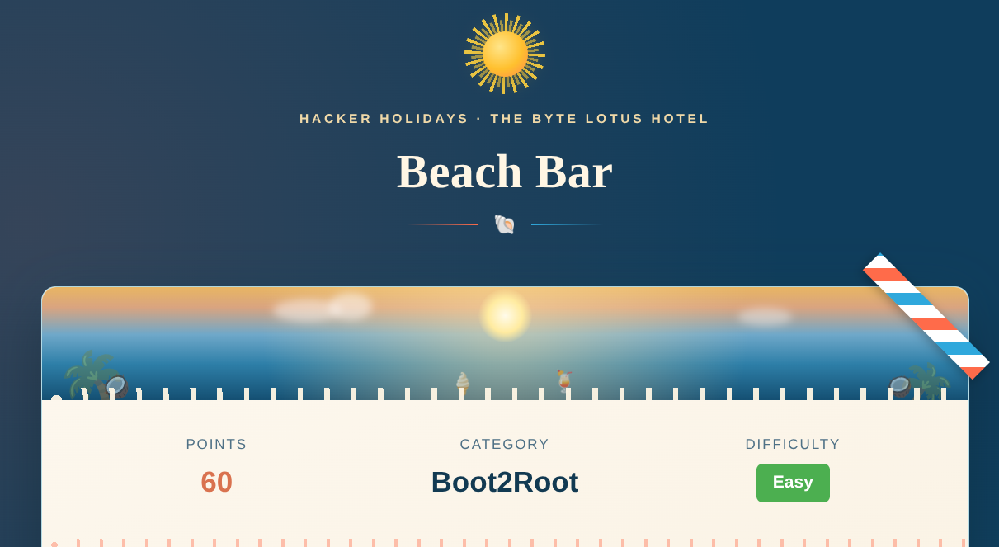
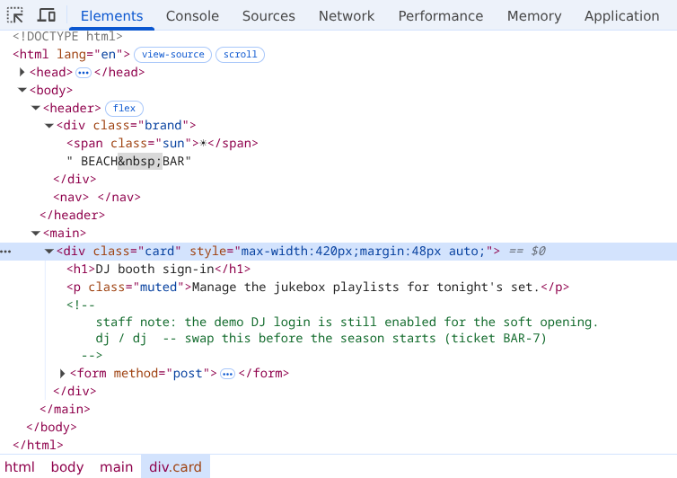
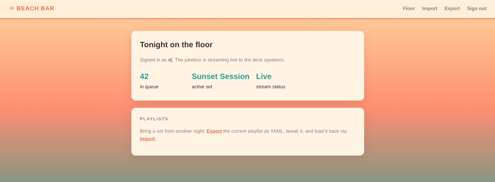
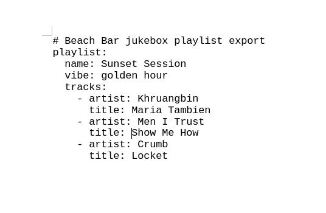
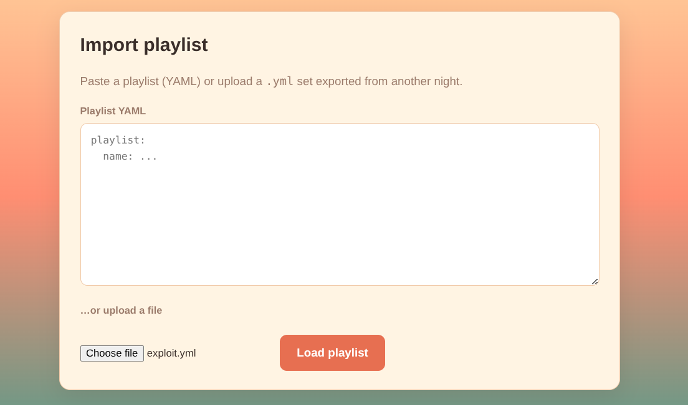
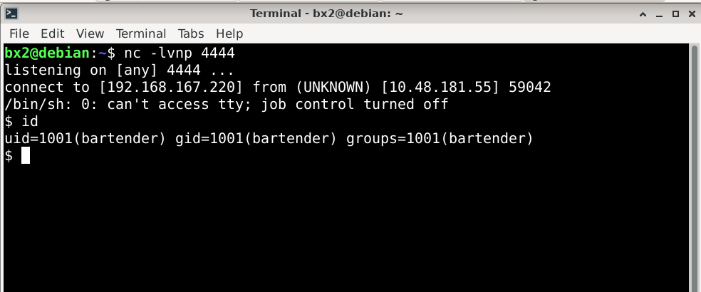
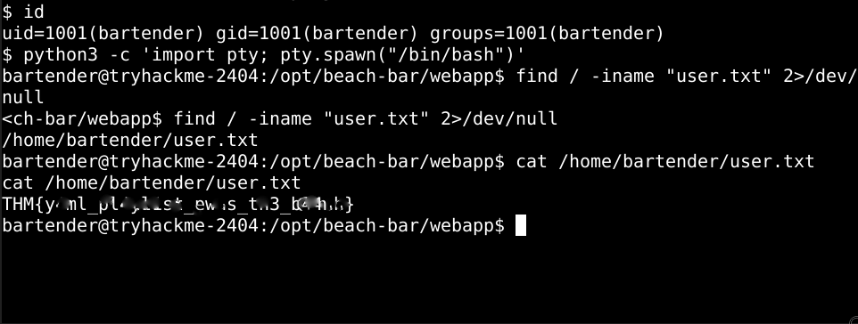
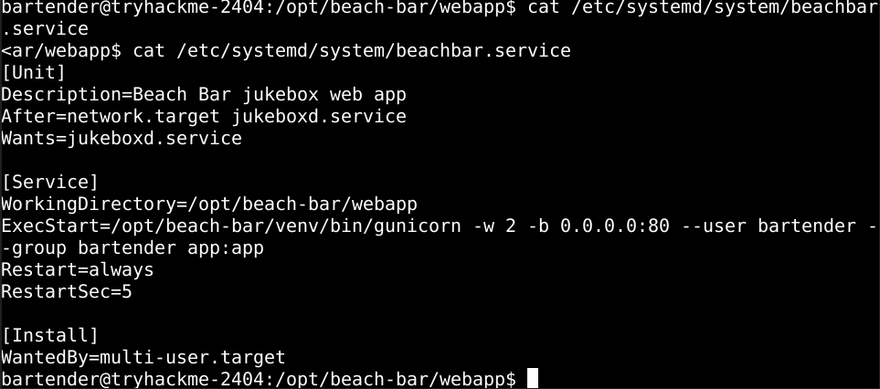
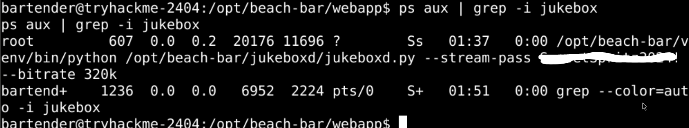
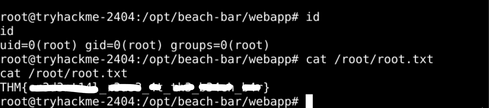

...

# Hacker Holidays 2026 — Day 5
<br><br><br>

**Room:** [Beach Bar](https://tryhackme.com/room/hh-beachbar-d849f7f7)  
**Platform:** TryHackMe  
**Difficulty:** Easy  
**Category:** Boot2Root / YAML Injection   
**Written:** 1 August 2026  

<br><br>

<br><br>

<br>

## Description

This writeup documents my methodology for obtaining initial access through an unsafe YAML import feature and escalating privileges by discovering credentials exposed in a privileged service process.


<br>

## Initial Recon

After opening the target web application, I was presented with a login page.

Since authentication was required before interacting with the application, I inspected the page source to look for any development artifacts or useful information.

Inside an HTML comment, I found credentials that appeared to be intended only for the development environment.

<br><br>

<br><br>


<br>

## Authenticated Access

Using the recovered credentials, I successfully authenticated to the application.

Once inside the dashboard, I noticed that the application supported both playlist export and playlist import functionality.

The presence of a YAML-based import feature immediately made it worth investigating further.

<br><br>

<br><br>


<br>

## Export Analysis

Before attempting to import my own playlist, I exported the existing one to understand the expected file format.

The exported playlist confirmed that the application processed playlist data using YAML.

<br><br>

<br><br>


<br>

## YAML Import Exploitation

After understanding the expected structure, I created a malicious YAML payload (see `docs/exploit.yml`) and imported it through the application's upload feature.

Once processed, the payload executed successfully and established a reverse shell to my listener.

<br><br>

<br><br>

<br><br>

<br><br>


<br>

## User Flag

After stabilizing the shell, I searched the filesystem for the user flag.

```bash
find / -iname "user.txt" 2>/dev/null
```

The search located the user flag inside the bartender user's home directory.

<br><br>

<br><br>


<br>

## Privilege Escalation Enumeration

With user access established, I began standard privilege escalation enumeration.

During this phase I inspected:

- Kernel version
- `sudo` permissions
- Cron jobs
- SUID binaries
- Environment variables
- Running services
- Active processes

None of the initial checks revealed an obvious privilege escalation path, so I shifted my attention to the services running on the system.


<br>

## Service Inspection

While reviewing the `beachbar.service` systemd unit, I noticed that it launched the `jukeboxd` application.

To understand how the service was running, I inspected the associated process.

```bash
cat /etc/systemd/system/beachbar.service
```

<br><br>

<br><br>

I then examined the running `jukeboxd` process.

```bash
ps aux | grep -i jukebox
```

The process was running as `root` and exposed a plaintext password as one of its command-line arguments.

<br><br>

<br><br>


<br>

## Root Access

I attempted to authenticate as the `root` user using the exposed credential.

The password was valid, successfully authenticating me as the `root` user.

After switching users, I retrieved the root flag.

```bash
su root
```

<br><br>

<br><br>


## Lessons Learned

- Client-side comments can unintentionally expose valid credentials.
- Export functionality can reveal the expected structure of imported data.
- Improperly validated YAML import functionality can lead to remote code execution.
- Standard privilege escalation enumeration often uncovers operational mistakes.
- Sensitive credentials should never appear in process command-line arguments.


**Final Thoughts:** This challenge demonstrates how multiple small security weaknesses can combine into a complete system compromise. Development credentials exposed in client-side comments enabled authenticated access, the vulnerable import functionality provided remote code execution, and plaintext credentials exposed by a privileged service ultimately resulted in full root access.

---

All Hail....

— **Nanashi Bx2** — Security Researcher