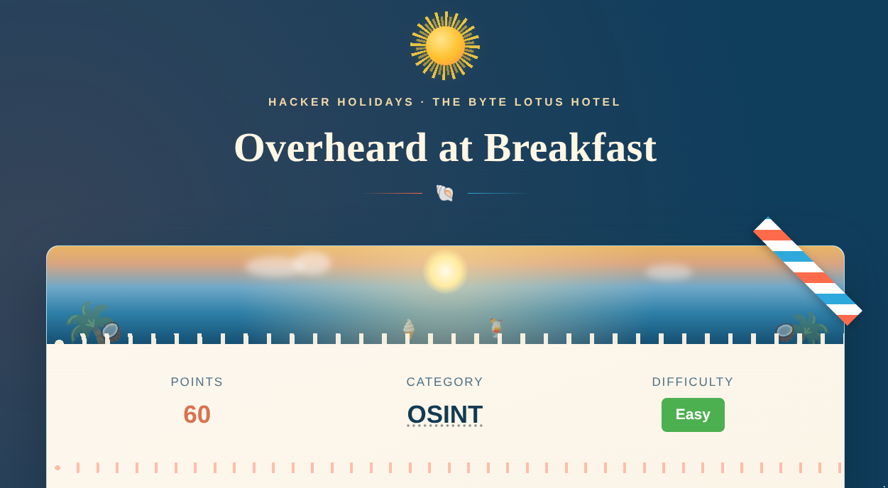
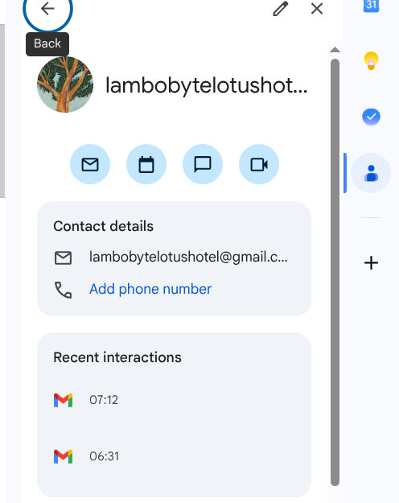
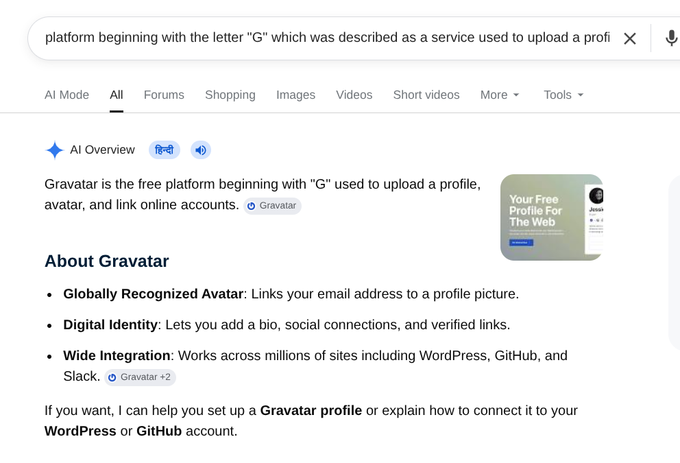
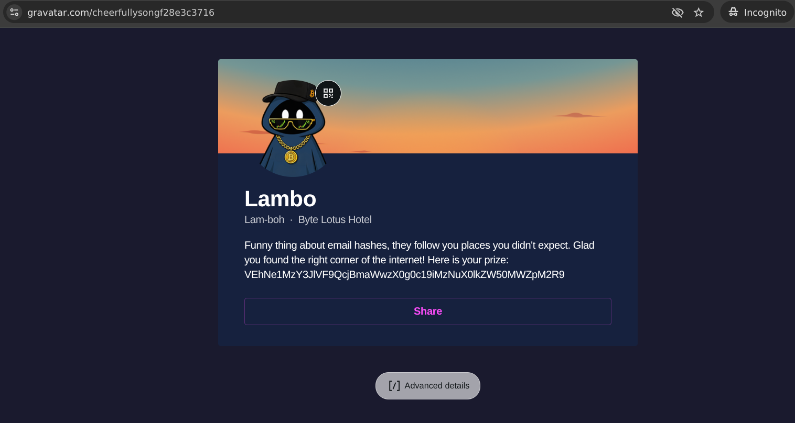
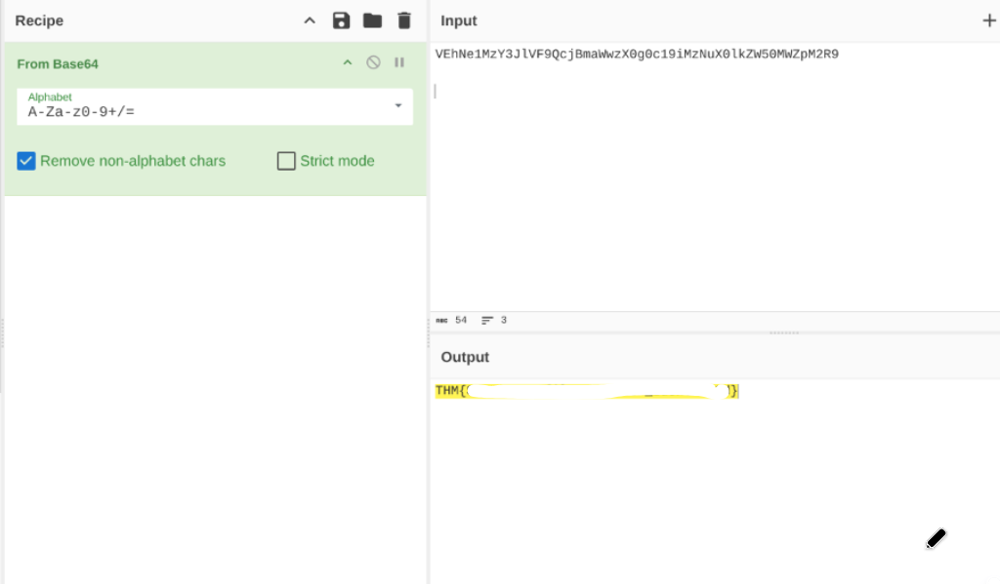

...

# Hacker Holidays 2026 — Day 6

**Room:** [Overheard at Breakfast](https://tryhackme.com/room/hh-overheardatbreakfast-6f01793c)  
**Platform:** TryHackMe    
**Difficulty:** Easy   
**Category:** OSINT / Digital Footprinting / Base64  
**Written:** 2 August 2026  

  

  

 

## Description

This writeup documents my methodology for following publicly available clues from a leaked conversation to identify an online profile and recover the challenge flag.

 

## Initial Analysis

After extracting the archive, I found a single image containing a conversation between two users.

I began reviewing the conversation to identify any information that could be used as an investigative starting point.

  

  

 

## Conversation Analysis

While reading the conversation, two details immediately stood out:

 - A Gmail address.
 - A reference to a platform beginning with the letter "G", described as a service used to upload a profile and link other online accounts.

Since the Gmail address was the most obvious lead, I began by performing basic reconnaissance against it.

  

  

 

## Platform Identification

The Gmail address itself did not reveal anything useful.

I then shifted my attention to the second clue and searched for services beginning with the letter "G" that matched the description from the conversation.

This search led me to **Gravatar**, a service that allows users to associate a public profile with an email address.

  

  

 

## Profile Analysis

Searching the recovered Gmail address on **Gravatar** located the associated public profile.

While the profile contained very little information, one field immediately stood out—a long Base64-encoded string that clearly did not resemble normal profile data.

  

  

 

## Data Decoding

Since Base64 is commonly used to hide or transport data in CTF challenges, I decided to decode it.

After decoding the recovered Base64 string, it revealed the challenge flag.

The investigation required no exploitation—only careful analysis of publicly available information and following the clues left throughout the conversation.

  

  

 

## Lessons Learned

- Small details in conversations can provide valuable investigative leads.
- Public profile services may unintentionally expose useful information.
- Simple encodings such as Base64 should always be examined during OSINT investigations.
- Effective OSINT often depends on following logical pivots rather than guessing.

**Final Thoughts:** This challenge demonstrates that not every investigation requires exploiting a vulnerability. By following publicly available clues, identifying the correct online profile, and decoding the recovered data, the hidden information could be successfully recovered.  

---

All Hail....

— **Nanashi Bx2** — Security Researcher