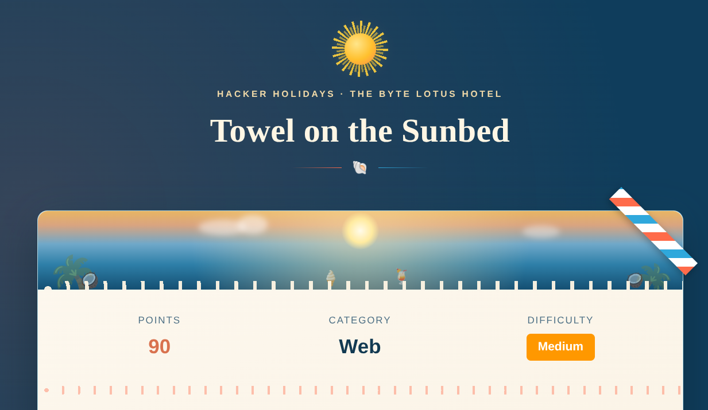
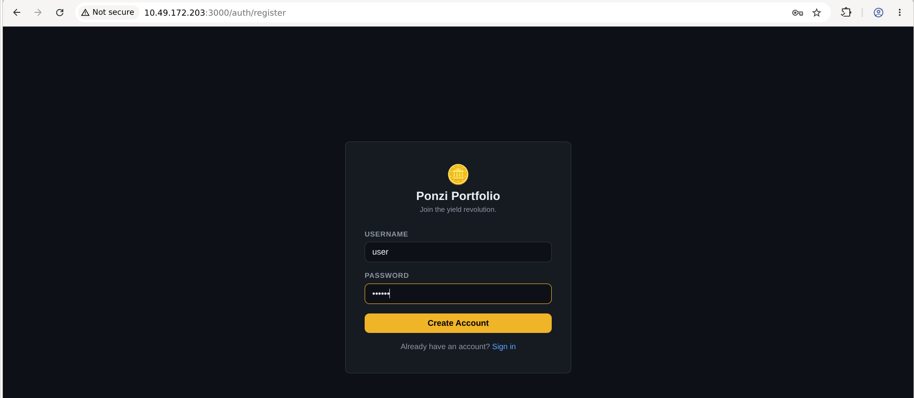
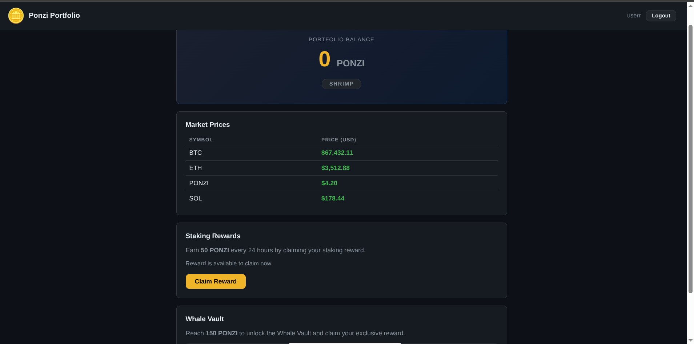
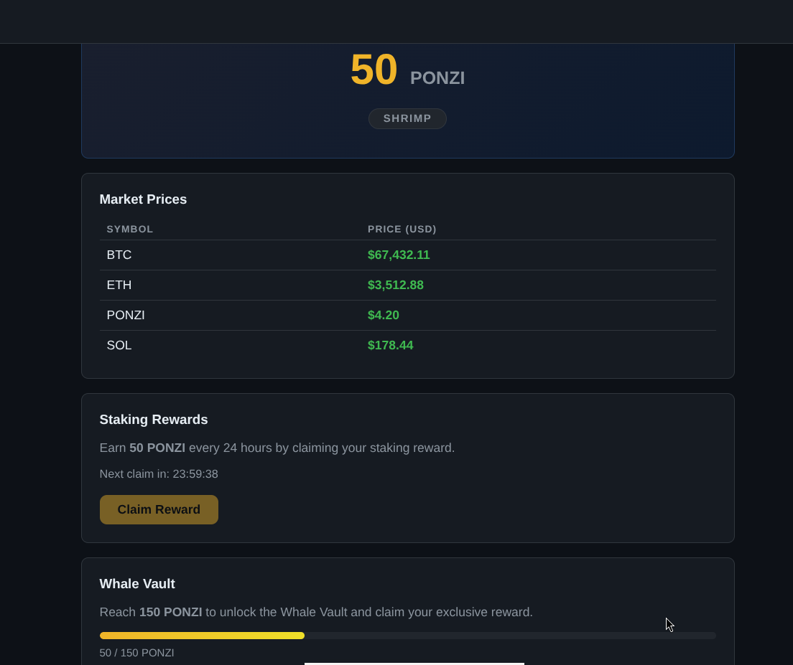
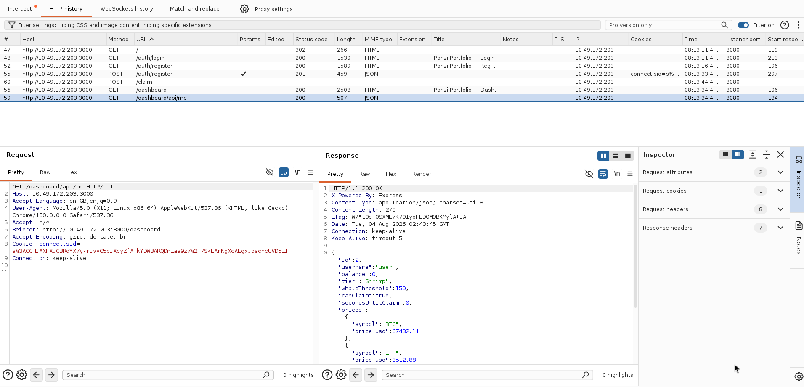
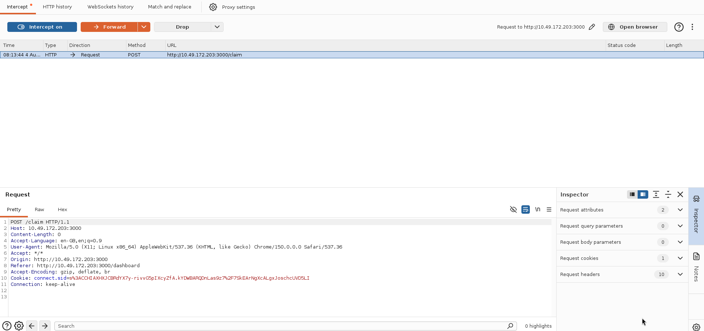
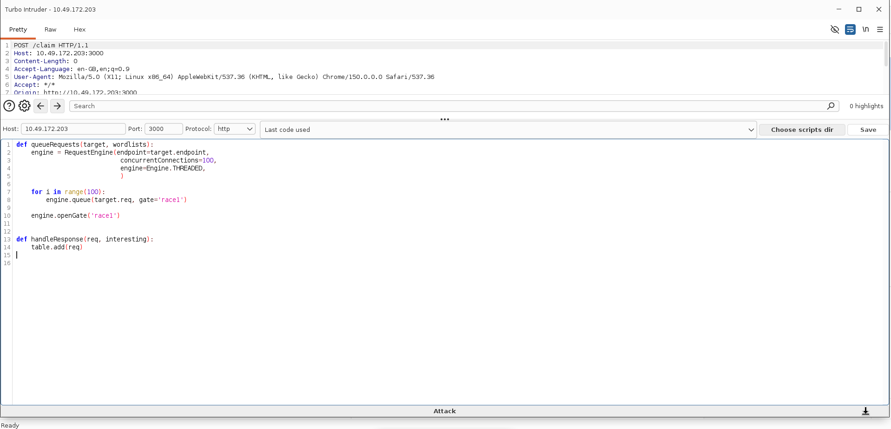
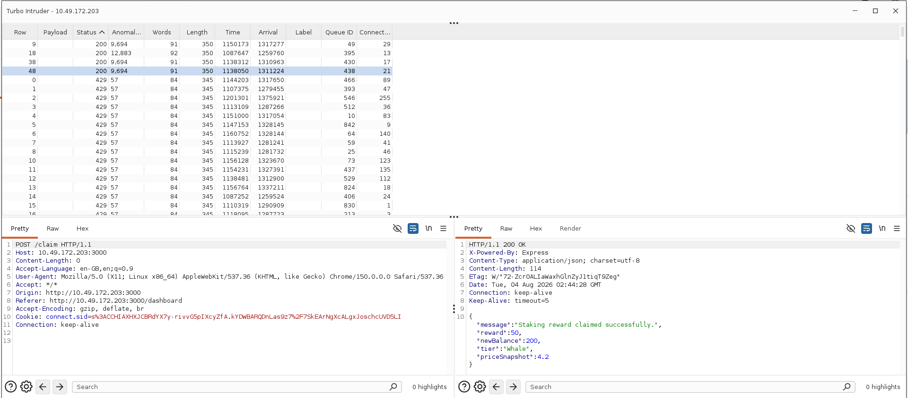
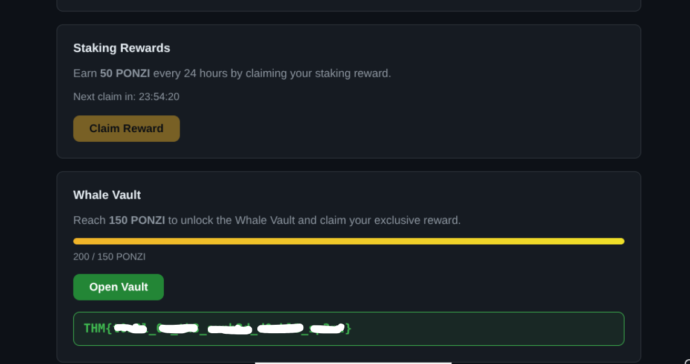

...

# Hacker Holidays 2026 — Day 8
  

**Room:** [Towel on the Sunbed](https://tryhackme.com/room/hh-towelonthesunbed)   
**Platform:** TryHackMe    
**Difficulty:** Medium    
**Category:** Web / Business Logic / Race Condition / API Abuse    
**Written:** 4 August 2026  

  

  

 

## Description

This writeup documents my methodology for exploiting a race condition in the application's daily reward mechanism. By sending multiple concurrent requests before the server updated the claim state, it was possible to bypass the intended one-claim-per-day restriction and unlock the Whale Vault.

 

## Initial Analysis

After opening the application, I found a simple authentication system with login and registration functionality.

I created a new account and logged in to begin exploring the application's features.

  

  

 

## Dashboard Analysis

The dashboard displayed several pieces of information:

- Current balance
- Daily staking reward
- Remaining cooldown timer
- Whale Vault progress

  

  

Claiming the daily reward granted **50 PONZI**, while the Whale Vault required **150 PONZI**.

Since rewards could normally be claimed only once every 24 hours, obtaining 150 PONZI through normal interaction would take multiple days.

  

  

The room description also hinted that the vulnerability existed somewhere between the client request and the server's timing logic, suggesting a possible business logic or race condition issue.

 

## Traffic Analysis

To understand how rewards were processed, I intercepted the application's requests using Burp Suite.

While inspecting the application's traffic, I identified the endpoint responsible for processing daily reward claims.

  

  

 

## Race Condition

I enabled interception and captured the reward claim request.

Instead of forwarding it normally, I sent the request to **Turbo Intruder**.

  

  

Using Turbo Intruder, I queued multiple identical requests and released them simultaneously.

The objective was to have several requests processed before the application updated the account's claim status.

  

  

Multiple requests returned HTTP 200 OK, confirming that several reward claims had been processed before the application enforced the daily claim restriction.

The account balance increased well beyond the intended single reward.

  

  

 

## Whale Vault

With the account balance now exceeding the required threshold, the Whale Vault became available.

Opening the vault successfully revealed the challenge flag.

  

  

 

## Lessons Learned

- Business logic flaws can be as impactful as traditional injection vulnerabilities.
- Client-visible cooldown timers do not guarantee secure server-side enforcement.
- Operations that modify shared state should be implemented atomically.
- Race conditions often become visible only when multiple concurrent requests are tested.
- Turbo Intruder is an effective tool for identifying concurrency-related vulnerabilities.

**Final Thoughts:** This challenge focused entirely on application logic rather than technical exploitation. Instead of bypassing authentication or injecting payloads, the vulnerability stemmed from the server accepting multiple concurrent reward requests before enforcing the daily claim restriction. Exploiting this race condition allowed the balance to exceed the intended limit and unlocked the Whale Vault.

---

All Hail....

— **Nanashi Bx2** — Security Researcher