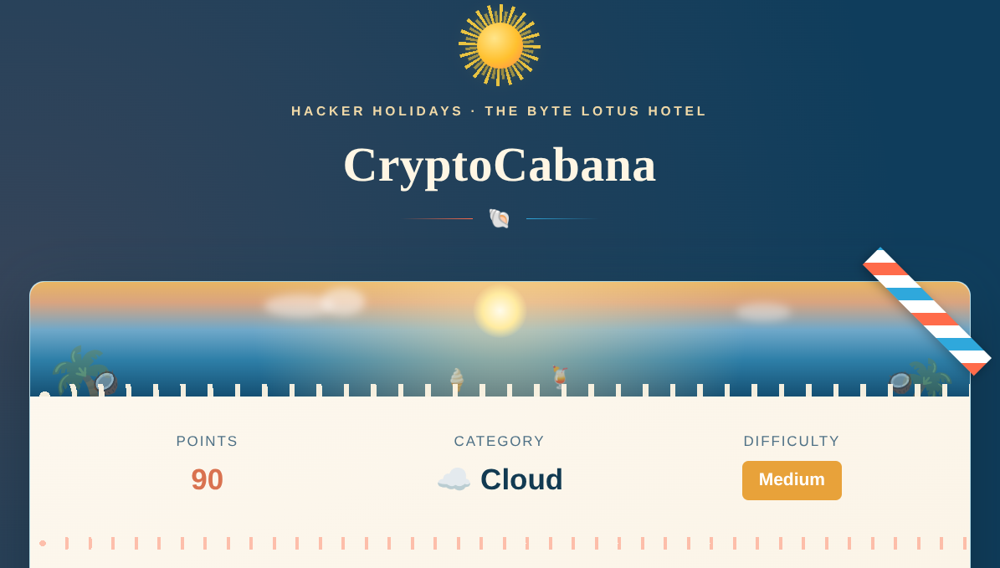
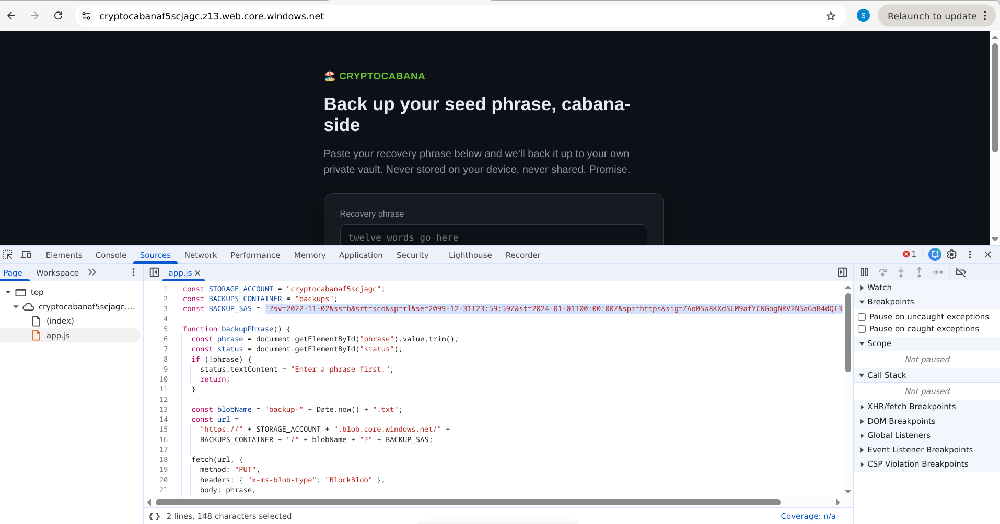
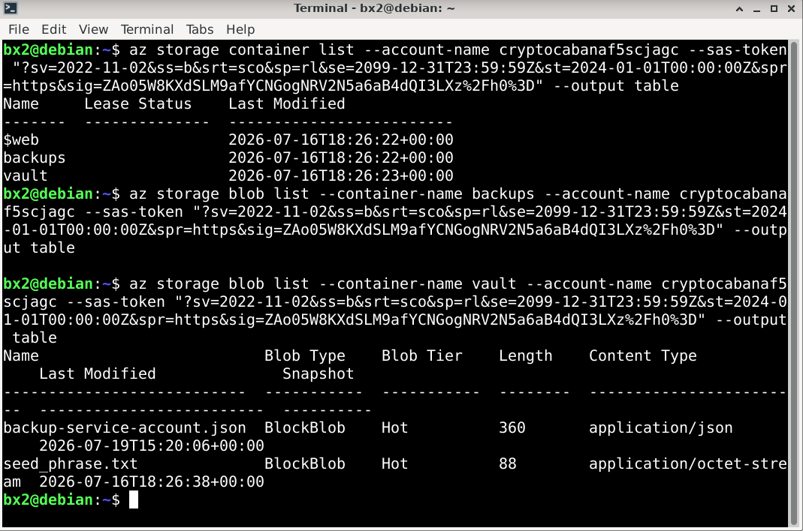
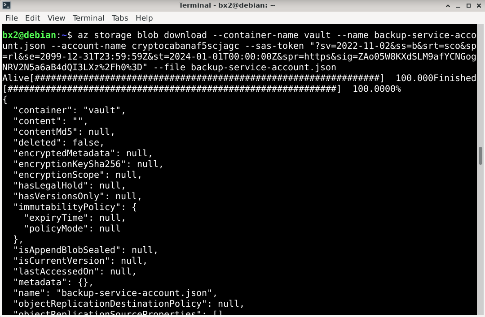
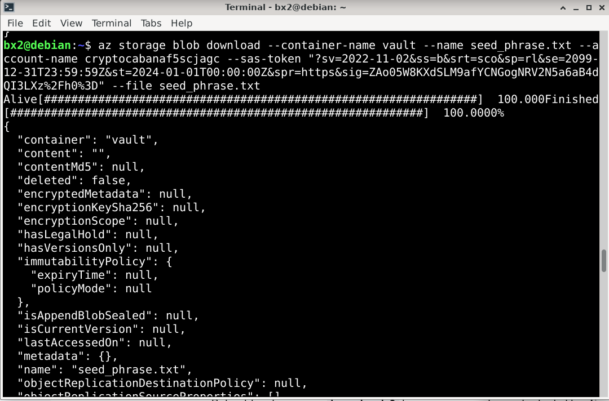
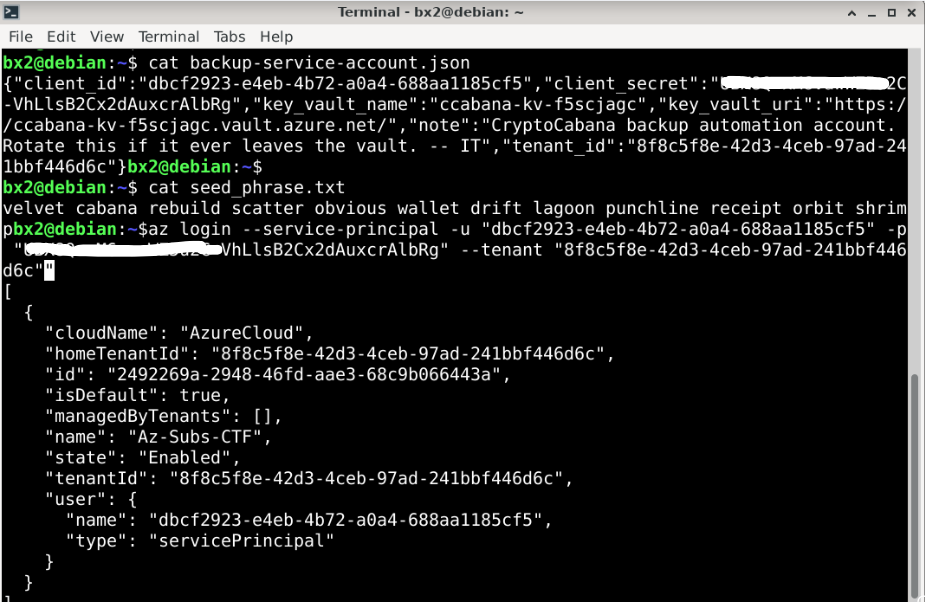
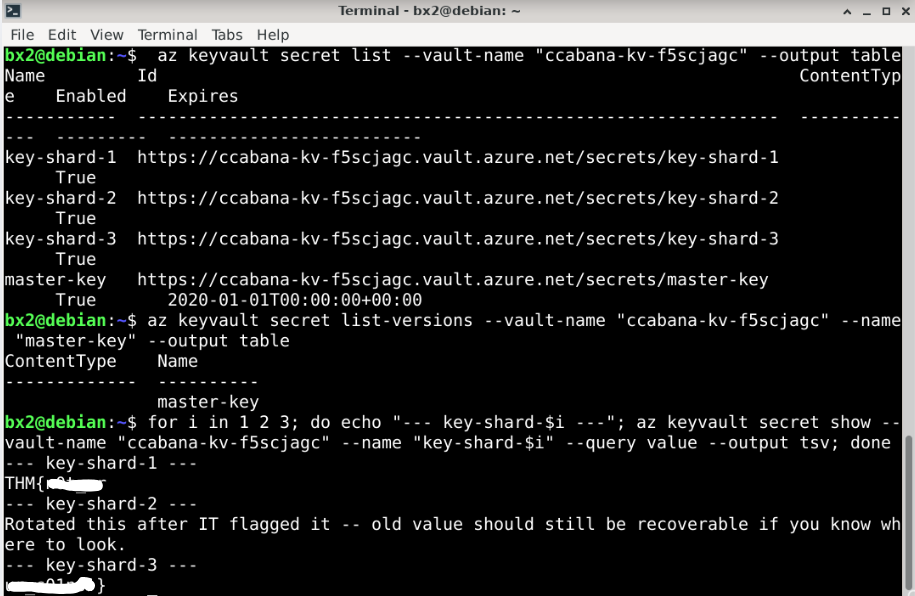
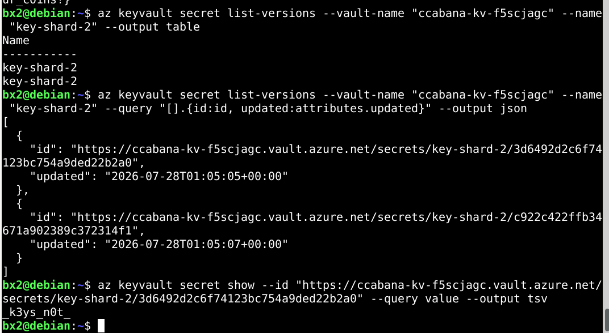

...

# Hacker Holidays 2026 — Day 9
<br><br>

**Room:** [CryptoCabana](https://tryhackme.com/room/hh-cryptocabana-f81cac95)       
**Platform:** TryHackMe      
**Difficulty:** Medium      
**Category:** Cloud / Azure / Storage / Key Vault      
**Written:** 5 August 2026  

<br><br>



<br><br>

<br>

## Description

This writeup documents my methodology for abusing an exposed Azure Storage SAS token to enumerate cloud storage, recover Service Principal credentials from a backup file, authenticate to Azure, and retrieve a previous version of a rotated Key Vault secret.

<br>

## Initial Analysis

After opening the application, I inspected the client-side JavaScript to understand how the backup functionality worked.

While reviewing the source code, I discovered that the application exposed several Azure Storage details, including the storage account name and a SAS token.

<br><br>



<br><br>

Since the SAS token appeared to provide direct access to Azure Storage, I decided to enumerate the available storage resources.

<br>

## Azure Storage Enumeration

Using the exposed Storage Account name together with the SAS token, I listed the available storage containers.

```bash
az storage container list ...
```

Three containers were present.

I first checked the `backups` container, but it did not contain any useful files.

I then enumerated the `vault` container, which contained two blobs.

<br><br>



<br><br>

<br>

## Downloading Backup Files

The two files inside the vault container were downloaded for inspection.

```bash
az storage blob download ...
```

<br><br>



<br><br>

<br><br>



<br><br>

One file contained a recovery phrase backup, while the second contained configuration data for the backup service.

Inspecting the configuration file revealed credentials for an Azure Service Principal.

<br>

## Azure Authentication

Using the recovered Service Principal credentials, I authenticated to Azure.

The login succeeded, confirming that the recovered credentials were valid.

<br><br>



<br><br>

<br>

## Key Vault Enumeration

After authenticating, I enumerated the available secrets inside the Azure Key Vault.

Several secrets were present, including a `master-key` secret.

Initially, the master key appeared to be the obvious target, but further inspection suggested it was not immediately useful.

I then inspected the remaining secrets.

One of them contained a note indicating that an older value might still be recoverable.

<br><br>



<br><br>

This suggested that the required data might exist in the secret's version history rather than its current value.

<br>

## Secret Version Recovery

I listed the available versions of the indicated secret.

After identifying the previous version, I retrieved its value.

The recovered value completed the missing secret material required for the challenge.

<br><br>



<br><br>

<br>

## Lessons Learned

- Client-side JavaScript should never expose Azure SAS tokens.
- A leaked SAS token can provide direct access to Azure Storage resources.
- Backup files stored in cloud storage may expose sensitive credentials.
- Compromised Service Principal credentials can provide privileged access across Azure resources.
- Azure Key Vault secret version history should be reviewed during cloud security assessments because previous values may still be accessible.

**Final Thoughts:** This challenge demonstrated how a single exposed SAS token can become the starting point for a complete cloud attack chain. Enumerating Azure Storage exposed backup files containing Service Principal credentials, which granted access to Azure resources. Careful enumeration of Azure Key Vault and its secret version history ultimately revealed the remaining secret material needed to complete the challenge.

---

All Hail....

— **Nanashi Bx2** — Security Researcher